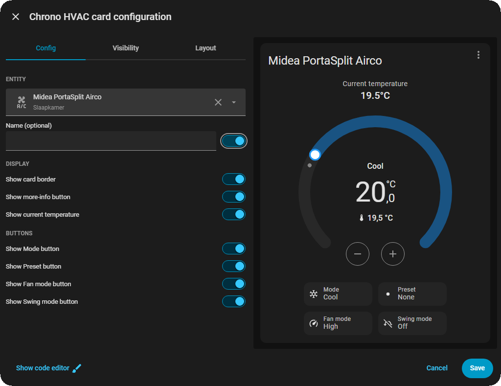

  
 <div align="center">

  [](https://github.com/hacs/integration)
  [](https://www.gnu.org/licenses/agpl-3.0)
  [](https://github.com/rob-vandenberg/chrono-slider-card/releases)

  

  

  <p align="center">
    <strong>A vertical slider card for your covers, screens, shades, blinds and awnings.<br>
            Slider direction, state and percentage are configurable so the slider<br>
            represents your device as makes the most sense to you.</strong>
  </p>

  <p align="center">
    <a href="#introduction">Introduction</a> •
    <a href="#key-features">Key Features</a> •
    <a href="#installation">Installation</a> •
    <a href="#usage">Usage</a> •
    <a href="#license">License</a>
  </p>

</div>

---

**Chrono Slider Card** is a dashboard card for any `cover` domain entity - blinds, shades, screens, and awnings. It gives you a full-height vertical slider you drag or tap to set position, directional open/stop/close buttons, and a set of favorite positions you can jump to in one tap. On top of that, it fixes a long-standing Home Assistant limitation: for an awning or a sun screen, "open" doesn't always mean "retracted" the way Home Assistant assumes. Choose the convention that matches your device, per entity, right from the editor.

---

## 📋 Table of Contents

- [Introduction](#introduction)
- [Key Features](#key-features)
- [Installation](#installation)
  - [HACS (Recommended)](#hacs-recommended)
  - [Manual Installation](#manual-installation)
- [Uninstallation](#uninstallation)
- [Usage](#usage)
  - [Adding the Card](#adding-the-card)
  - [Options](#options)
  - [Custom Styling](#-custom-styling)
- [Limitations](#limitations)
- [License](#license)
- [Support](#support)

---

## 🚀 Key Features

### 🎯 Open Means What You Mean, Per Device
Home Assistant's native model treats "open" as retracted - correct for a blind, wrong for an awning, and wrong again for a sun screen in a different way. Chrono Slider Card lets each entity independently choose `cover` (native Home Assistant), `screen`, or `awning`, with the state text, the percentage, and the slider fill all consistent with whichever one you pick.

### 🖐️ Drag, Tap, or Click
A full-height vertical slider you can drag to any position, or tap a favorite position for an instant jump. A live percentage tooltip follows your finger while you drag.

### 🔀 Slider or Buttons, Your Call
Switch between the position slider and simple open/stop/close buttons, either as the card's default control or live, on demand, with a toggle right on the card.

### ⭐ Favorite Positions
Set any number of one-tap favorite positions - not just open and closed. The default set is 0%, 25%, 75%, and 100%, fully customizable.

### 👁️ Show or Hide Anything
Turn off the name, the state text, the percentage, the relative-time label, the favorites row, the slider/buttons toggle, or the entire controls area (slider, buttons, and toggle together) for a favorites-only layout. Build the exact card you want.

### 🎨 Custom CSS, From YAML
Every element on the card - card, title, state, buttons, slider, favorites, and more - can be restyled directly from your dashboard config with a `styles:` block. A handful of built-in CSS variables also let you change one thing - like the slider's color or corner rounding - and have it apply everywhere it's used, in a single edit. No editing the card's source, no browser dev tools required.

### 📐 Fits Any Dashboard
The card sizes itself to its own content and shrinks gracefully with the grid column width. It works the same in masonry, sections, and panel views, with no layout code needed.

### 🎨 Matches Your Theme
Colors come from your Home Assistant theme automatically, the same way the native more-info dialog's cover controls do.

---

## 📦 Installation

### HACS (Recommended)

1. Open **HACS** in your Home Assistant instance.
2. Navigate to **Frontend** and click the three-dot menu in the top right corner.
3. Select **Custom repositories**.
4. Enter `https://github.com/rob-vandenberg/chrono-slider-card` and select **Lovelace** as the category.
5. Click **Add**. The repository will appear in the list.
6. Search for `Chrono Slider Card` and click **Download**.
7. Reload your browser.

### Manual Installation

1. Download `chrono-slider-card.js` from the [latest release](https://github.com/rob-vandenberg/chrono-slider-card/releases/latest).
2. Copy it to your Home Assistant `config/www/` folder.
3. In Home Assistant, go to **Settings → Dashboards → Resources**.
4. Click **Add Resource**.
5. Enter `/local/chrono-slider-card.js` as the URL and select **JavaScript Module**.
6. Click **Create** and reload your browser.

---

## 🗑️ Uninstallation

### Via HACS
1. Open **HACS → Frontend**.
2. Find **Chrono Slider Card** and click the three-dot menu.
3. Select **Remove**.
4. Reload your browser.

### Manual
1. Delete `chrono-slider-card.js` from `config/www/`.
2. Remove the resource entry from **Settings → Dashboards → Resources**.
3. Remove any cards using `chrono-slider-card` from your dashboards.

---


---

## ⚙️ Usage

### Adding the Card

1. Open a dashboard and click **Edit Dashboard**.
2. Click **Add Card**.
3. Search for **Chrono Slider Card**.
4. Pick a `cover` entity from the dropdown.
5. Use the editor to choose device type, control style, and what's shown or hidden.



If you'd rather write YAML directly, here's a full example:

```yaml
type: custom:chrono-slider-card
entity: cover.living_room_awning
name: Living Room Awning
device_type: awning
show_name: true
show_state: true
show_percentage: true
show_last_changed: true
show_controls: true
show_control_switch_buttons: false
show_favorites: true
default_control: slider
favorite_positions: '{0:Close}, 25, 75, {100:Open}'
```

### Options

| Key | Type | Default | What it does |
| :--- | :--- | :--- | :--- |
| `entity` | text | required | The `cover` entity to control. |
| `name` | text | (none) | A custom name to show above the card. Leave it out to use the entity's own name. |
| `device_type` | `cover`/`screen`/`awning` | `cover` | Tells the card what "open" actually means for your device. For `screen` and `awning`, the percentage and the slider always represent how far the device is physically extended - 100% is always fully extended, no matter which end is labeled "open." `cover` is the exception: it mirrors Home Assistant's own native position value directly (100% = fully retracted), matching the convention some people already know. Pick `screen` for a sun screen (retracted = open), `awning` for an awning (extended = open). |
| `favorite_positions` | list of numbers, or comma-separated text | `[0, 25, 75, 100]` | The one-tap favorite positions shown below the slider. Any number of entries is supported. Each entry can be a plain percentage (`50`), which shows as `50%`, or a custom label using `{value:label}` (e.g. `{0:Close}`), which shows the label as-typed instead of a percentage. |
| `show_name` | `true`/`false` | `true` | Shows the name above the card. |
| `show_state` | `true`/`false` | `true` | Shows the "Opened"/"Closed"/"Opening"/"Closing" text. |
| `show_percentage` | `true`/`false` | `true` | Shows the position percentage under the state text. |
| `show_last_changed` | `true`/`false` | `true` | Shows the relative-time label under the state text (e.g. "3 hours ago"). |
| `show_controls` | `true`/`false` | `true` | Shows the entire controls area - the slider, directional buttons, and the slider/buttons switch toggle - together. Turn off to show only favorites (and any name/state/percentage/last-changed) - useful for a favorites-only layout. |
| `show_control_switch_buttons` | `true`/`false` | `false` | Shows the toggle icons that switch the card between the slider and the open/stop/close buttons. |
| `show_favorites` | `true`/`false` | `true` | Shows the row of favorite-position buttons. |
| `default_control` | `slider`/`buttons` | `slider` | Which control is shown by default when the card loads. Matches the "Control" field in the editor. |
| `styles` | object | (none) | Advanced: restyle individual elements of the card directly from YAML. See [Custom Styling](#-custom-styling) below. |

Using a top-level key that isn't in this list, or a value that isn't valid, won't break the card - it's just ignored.

**Advanced:** if `device_type` doesn't quite match your specific device, you can override the three things it controls individually, directly in YAML: `device_open_state`, `device_open_percentage`, and `device_open_slider` (each `true`/`false`). These aren't in the visual editor - they're an escape hatch for the rare device that doesn't fit `cover`, `screen`, or `awning` exactly. Most people will never need them.

### 🎨 Custom Styling

Every visual piece of the card can be restyled directly from your dashboard config, without touching the card's source or your browser's dev tools. Under `styles:`, each entry is a CSS class name paired with the CSS properties you want to change on it:

```yaml
type: custom:chrono-slider-card
entity: cover.living_room_blind
styles:
  ha-card:
    border: none
  slider:
    border-width: 2px
    border-style: solid
    border-color: '#ff0000'
  favorite-button:
    border-radius: 4px
```

The class names match exactly what you'd find inspecting the card with your browser's dev tools. A handful of the most useful ones: `ha-card`, `title`, `state`, `percentage`, `last-changed`, `control-slider-host`, `slider-container`, `slider`, `handle`, `main-control`, `control-button-group`, `control-button`, `icon-button-group`, `icon-toggle-button`, `tooltip`, `favorites`, `favorite-button`.

One key is special: `host` targets the card's own outer element (not a class) - use it to change things like the card's outer margin.

```yaml
styles:
  host:
    margin: 0
```

Some elements exist as more than one instance on the card - the three directional buttons, the two mode-toggle buttons, and the favorite-position buttons. Styling their shared class (e.g. `control-button`, `icon-toggle-button`, `favorite-button`) changes all of them at once. To style just one, use its own specific class instead: `control-button-close` / `control-button-stop` / `control-button-open` for the directional buttons, `icon-toggle-button-position` / `icon-toggle-button-button` for the mode-toggle buttons, and `favorite-button-<value>` (e.g. `favorite-button-30`) for an individual favorite position.

There's no validation on `styles:` - any class name and any CSS property is accepted and applied exactly as written, even if it doesn't match anything on the card or doesn't make visual sense. This gives you full control, but also means a typo will silently do nothing rather than warn you.

#### Built-in CSS variables

A regular property override only affects the one class you targeted. On top of that, the card exposes its own full set of CSS variables covering fonts, spacing, colors, and corner rounding across every part of the card, each with a sensible default. Set these the same way, under whichever class the table below lists for it, written with quotes since they start with `--`:

```yaml
styles:
  control-slider-host:
    "--slider-border-radius": 6px
    "--slider-color": '#ff9800'
```

| Variable | Set it under | Default | What it changes |
| :--- | :--- | :--- | :--- |
| `--host-margin` | `host` | `8px` | Outer margin around the whole card. |
| `--ha-card-padding` | `ha-card` | `16px 8px 8px 8px` | Inner padding of the card. |
| `--transition-duration` | `ha-card` | `180ms` | Duration of the fade/slide/color transitions used throughout the card (shades, slider fill, tooltip, favorite buttons, etc). |
| `--focus-ring-width` | `ha-card` | `2px` | Thickness of the keyboard focus outline on the slider and directional buttons. |
| `--title-font-size` | `title` | `20px` | Font size of the name shown above the card. |
| `--title-font-weight` | `title` | `500` | Font weight of the name. |
| `--title-line-height` | `title` | `1.2` | Line height of the name. |
| `--title-margin-bottom` | `title` | `16px` | Gap between the name and the content below it. |
| `--state-font-size` | `state` | `32px` | Font size of the Opened/Closed/Opening/Closing text. |
| `--state-font-weight` | `state` | `400` | Font weight of the Opened/Closed/Opening/Closing text. |
| `--state-line-height` | `state` | `1.2` | Line height of the state text. |
| `--state-padding-y` | `state` | `4px` | Vertical padding above/below the state text. |
| `--label-letter-spacing` | `percentage` or `last-changed` | `0.1px` | Letter spacing of the percentage and relative-time labels (shared by both). |
| `--percentage-font-size` | `percentage` | `16px` | Font size of the position percentage. |
| `--percentage-font-weight` | `percentage` | `500` | Font weight of the position percentage. |
| `--percentage-line-height` | `percentage` | `1.5` | Line height of the position percentage. |
| `--percentage-padding-y` | `percentage` | `4px` | Vertical padding above/below the percentage. |
| `--last-changed-font-size` | `last-changed` | `16px` | Font size of the relative-time label (e.g. "3 hours ago"). |
| `--last-changed-font-weight` | `last-changed` | `500` | Font weight of the relative-time label. |
| `--last-changed-line-height` | `last-changed` | `1.5` | Line height of the relative-time label. |
| `--last-changed-padding-y` | `last-changed` | `4px` | Vertical padding above/below the relative-time label. |
| `--controls-margin-top` | `controls` | `16px` | Gap above the controls area (slider/buttons). |
| `--controls-margin-bottom` | `controls` | `8px` | Gap below the controls area, above whatever section comes next. |
| `--controls-height` | `control-slider-host` or `control-button-group` | `45vh` | Height of the active control (slider or directional buttons). Shared between both, so they stay the same size regardless of which is showing. |
| `--controls-max-height` | `control-slider-host` or `control-button-group` | `320px` | Maximum height of the active control. |
| `--controls-min-height` | `control-slider-host` or `control-button-group` | `200px` | Minimum height of the active control. |
| `--control-button-group-min-width` | `control-button-group` | `54px` | Narrowest the directional-button column is allowed to shrink to. |
| `--control-button-group-max-width` | `control-button-group` | `100px` | Widest the directional-button column is allowed to grow to. |
| `--control-button-group-item-gap` | `control-button-group` | `10px` | Vertical spacing between the three directional buttons. |
| `--main-control-item-margin` | `main-control` | `8px` | Horizontal spacing between the slider and the directional-button group. |
| `--slider-color` | `control-slider-host` | The entity's current state color | The color of the filled part of the slider, and the focus outline shown when the slider is selected with a keyboard. |
| `--slider-background` | `control-slider-host` | The entity's current state color, dimmed | The color of the empty (unfilled) part of the slider track. |
| `--slider-background-opacity` | `control-slider-host` | `0.2` | How dim the empty part of the track is. `1` removes the dimming entirely, `0` makes it invisible. |
| `--slider-min-width` | `control-slider-host` | `80px` | The narrowest the slider is allowed to shrink to. |
| `--slider-max-width` | `control-slider-host` | `130px` | The widest the slider is allowed to grow to. Together with `--slider-min-width`, also sets how far the handle can travel from the top and bottom edges (see `--handle-margin`). |
| `--slider-border-radius` | `control-slider-host` | `36px` | How rounded the slider's own outer corners are. |
| `--slider-track-bar-border-radius` | `control-slider-host` | `8px` | How rounded the corners of the filled bar inside the slider are. Kept independent of `--slider-border-radius` so the fill doesn't distort into a flattened dome shape at low percentages. |
| `--handle-size` | `slider-container` | `4px` | The thickness of the white handle bar. |
| `--handle-color` | `slider-container` | `white` | The color of the handle bar. |
| `--handle-margin` | `slider-container` | The larger of `--slider-min-width`/`--slider-max-width`, ÷ 8 | How far the handle sits from the top/bottom edge at each extreme. Set this directly to override the automatic width-based value. |
| `--state-cover-inactive-color` | `control-slider-host` | The entity's own "open" reference color | Used behind the scenes for a closed device's muted color tone, matching Home Assistant's own theming convention. Most people won't need to touch this one. |
| `--control-button-border-radius` | `control-button` | `36px` | Corner rounding of each directional (open/stop/close) button. |
| `--control-button-padding` | `control-button` | `8px` | Padding inside each directional button, around its icon. |
| `--overlay-opacity` | `control-button` or `favorite-button` | `0.2` | Opacity of the dim shade shown on disabled directional buttons and inactive favorite buttons. Shared across both. |
| `--button-icon-size` | `control-button` or `icon-toggle-button` | `24px` | Size of the icon inside a directional button or a mode-toggle icon. Shared across both. |
| `--disabled-text-color` | `control-button` | `#6f6f6f` | Icon color of a directional button while it's disabled. |
| `--controls-gap` | `icon-button-group` | `20px` | Gap between the controls area and the slider/buttons toggle icons below it. |
| `--icon-button-group-border-radius` | `icon-button-group` | `9999px` | Corner rounding of the slider/buttons toggle pill. |
| `--icon-button-group-background` | `icon-button-group` | `rgba(139, 145, 151, 0.1)` | Background fill color of the toggle pill. |
| `--icon-button-group-min-width` | `icon-button-group` | `54px` | Narrowest the slider/buttons toggle pill is allowed to shrink to. |
| `--icon-button-group-max-width` | `icon-button-group` | `100px` | Widest the slider/buttons toggle pill is allowed to grow to. |
| `--icon-button-group-height` | `icon-button-group` | `48px` | Height of the toggle pill. |
| `--icon-toggle-button-size` | `icon-toggle-button` | `40px` | Size of each mode-toggle icon button, and its selection highlight. |
| `--icon-toggle-button-gap` | `icon-toggle-button` | `4px` | Spacing around each mode-toggle icon button. |
| `--icon-toggle-border-radius` | `icon-toggle-button` | `9999px` | Corner rounding of the highlight behind the currently-selected toggle icon. |
| `--icon-toggle-shade-expand` | `icon-toggle-button` | `-10px` | How far the selection highlight extends beyond the icon itself on each side. |
| `--icon-toggle-hover-opacity` | `icon-toggle-button` | `0.1` | Opacity of the highlight shown when hovering an unselected toggle icon. |
| `--favorites-gap` | `favorites` | `16px` | Gap above the favorites row. |
| `--favorites-margin-bottom` | `favorites` | `8px` | Gap below the favorites row. |
| `--favorite-button-gap` | `favorites` | `16px` | Gap between individual favorite-position buttons within the row. |
| `--favorites-max-width` | `favorites` | `384px` | Maximum width of the favorites row before buttons wrap to a new line. |
| `--favorite-button-min-width` | `favorite-button` | `54px` | Narrowest each favorite-position button is allowed to shrink to. |
| `--favorite-button-max-width` | `favorite-button` | `100px` | Widest each favorite-position button is allowed to grow to. |
| `--favorite-button-height` | `favorite-button` | `36px` | Height of each favorite-position button. |
| `--favorite-button-padding` | `favorite-button` | `8px` | Inner padding of each favorite-position button. |
| `--favorite-button-border-radius` | `favorite-button` | `9999px` | Corner rounding of each favorite-position button. |
| `--favorite-button-font-family` | `favorite-button` | Inherited from the card | Font family of the favorite-position button labels. |
| `--favorite-button-font-weight` | `favorite-button` | `500` | Font weight of the favorite-position button labels. |
| `--favorite-button-label-opacity` | `favorite-button` | `0.95` | Opacity of the favorite-position button labels. |
| `--state-cover-active-color` | `favorite-button` | `--primary-color` | Highlight color of the favorite-position button matching the entity's current position. |
| `--tooltip-font-size` | `tooltip` | `20px` | Font size of the percentage tooltip shown while dragging the slider. |
| `--tooltip-border-radius` | `tooltip` | `12px` | Corner rounding of the drag tooltip. |
| `--tooltip-padding` | `tooltip` | `0.2em 0.4em` | Inner padding of the drag tooltip. |
| `--tooltip-shadow` | `tooltip` | `0 2px 5px rgba(0, 0, 0, 0.2)` | Drop shadow of the drag tooltip. |
| `--tooltip-offset` | `tooltip` | `-4px` | Horizontal offset of the drag tooltip from the slider's edge. |
| `--clear-background-color` | `tooltip` | `#212121` | Background color of the drag tooltip. |

---

## ⚠️ Limitations

- Only entities from the `cover` domain are supported.
- One entity per card. Add another card for another entity.
- The card controls a single entity's position directly - it doesn't group or synchronize multiple covers. Grouping is a possible future feature, not currently supported.
- Dragging the slider relies on pointer events; very old browsers without pointer event support aren't tested.

---

## ⚖️ License

**GNU Affero General Public License v3.0 (AGPL-3.0)**

This project is licensed under the AGPL-3.0. You are free to use, modify, and distribute this software, provided that any modifications or derivative works that are made available — including over a network — are also distributed under the same license.

Full license text: [https://www.gnu.org/licenses/agpl-3.0](https://www.gnu.org/licenses/agpl-3.0)

Copyright © 2026 Rob Vandenberg. All rights reserved.

---

## ☕ Support

If you find this project useful and wish to support its continued development, please consider a contribution.

[](https://www.buymeacoffee.com/robvandenberg)
